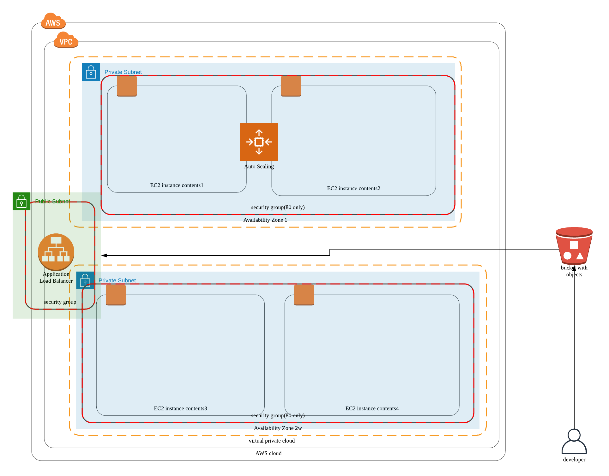

## high avaliavility submit

### 概要

StackName: udagramMiyaoka
s3BucketName: udagram-test-seiya

- サーバをprivateサブネットに配置。
- apache server
- s3
- server size 4
- 自分でapacheはいれるhttps://www.linuxacademy.ne.jp/lablog/infrastructure/532/
- s3に他の開発者がデータを配置する予定
- [ ] ubuntuimage amiを探す ami-07b4f3c02c7f83d59
- roleの作成が絡むと https://blog.websandbag.com/entry/2017/12/30/234729 capabilitiyの設定が必要
- keypairはブラウザで作成した
- Download dirにある
- keyなしで作成してあとからkeyを付与はできなかった, なのでインスタンスを増やしてそちらでテスト
- vpcに関連づけられるmain route tableを変更してみる
- routeテーブルの設定ができていないとトラッフィックの処理をしないのでsshできない

configure

